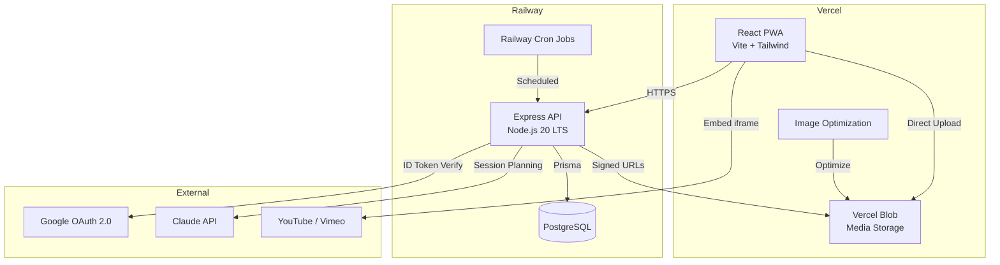
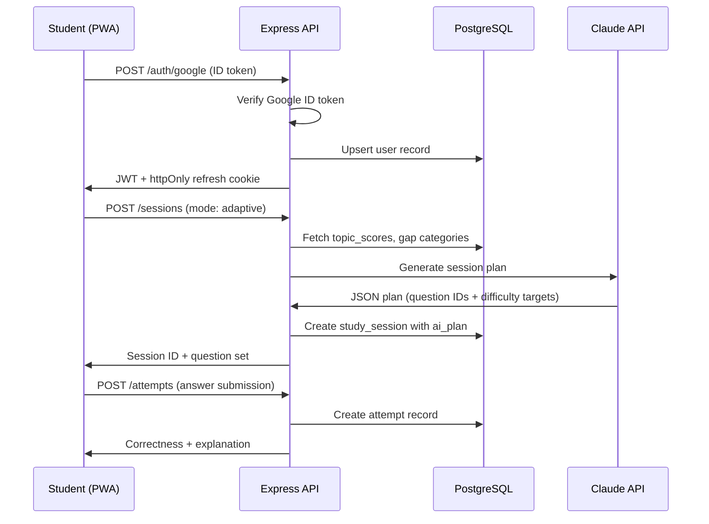
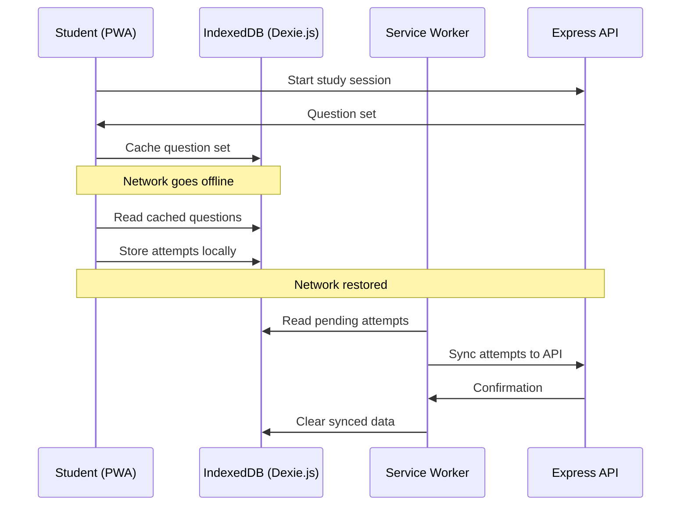

# Technical Design Document — PA Exam Prep App

## Overview

The PA Exam Prep App is an adaptive study platform for Physician Assistant students preparing for PANCE/PANRE exams. The system consists of a React 18 PWA frontend hosted on Vercel and a Node.js/Express API with PostgreSQL on Railway. An AI adaptive engine powered by the Claude API personalizes study sessions based on Elo-style scoring, gap detection, and spaced repetition decay.

The architecture follows a standard client-server model: the React PWA communicates with the Express API over HTTPS, the API manages all business logic and data access through Prisma ORM, and background cron jobs handle nightly score recalculation, decay, and analytics rollup. Media assets are stored in Vercel Blob with signed URL access. Authentication uses Google OAuth 2.0 with JWT + rotating refresh tokens.

### Key Design Decisions

| Decision | Rationale |
|---|---|
| PostgreSQL only (no Redis) | Low volume at launch; Postgres handles all data needs |
| Railway cron for background jobs | No queue system needed at launch scale |
| Dexie.js for offline storage | IndexedDB wrapper for caching active study sessions offline |
| Prisma ORM | Type-safe queries, clean migrations, strong TypeScript integration |
| Zod validation | Runtime schema validation for all API inputs |
| Vercel Blob + signed URLs | Secure media delivery without exposing bucket directly |
| Light mode only | Reduces design surface; dark mode deferred |

## Architecture

### System Architecture Diagram



### Request Flow



### Offline Flow




## Components and Interfaces

### Frontend Components

#### Route Structure

| Route | Component | Auth | Description |
|---|---|---|---|
| `/login` | `LoginPage` | Public | Google OAuth sign-in |
| `/diagnostic` | `DiagnosticPage` | Student | 20-question baseline assessment |
| `/dashboard` | `DashboardPage` | Student | Readiness score, focus areas, streak |
| `/study` | `StudyModePicker` | Student | Select session mode |
| `/study/session/:id` | `SessionPage` | Student | Active question interface |
| `/study/session/:id/review` | `SessionReviewPage` | Student | Post-session summary |
| `/library` | `LibraryPage` | Student | Question bank, videos, bookmarks, PDFs |
| `/library/cases` | `CaseBrowserPage` | Student | Browse LITFL cases by topic, difficulty, source |
| `/library/cases/:caseId` | `CaseDetailPage` | Student | Case view with sub-cases and progressive questions |
| `/progress` | `ProgressPage` | Student | Heatmap + analytics |
| `/admin` | `AdminDashboard` | Admin | Usage reports |
| `/admin/users` | `AdminUsersPage` | Admin | User management |
| `/admin/questions` | `AdminQuestionsPage` | Admin | Question bank CRUD |
| `/admin/questions/import` | `AdminImportPage` | Admin | JSON import/export |
| `/admin/media` | `AdminMediaPage` | Admin | Media upload + management |

#### Key UI Components

- `QuestionCard` — Single-question view with stem, options, media, flag/bookmark actions
- `AnswerFeedback` — Post-submission rationale with correct/incorrect indicators (icons + color)
- `ConfidenceRating` — Optional 1–3 scale before answer submission
- `MediaViewer` — Inline media display with tap-to-expand for images/EKGs
- `HeatmapGrid` — NCCPA category grid with color + label/pattern mastery indicators
- `ReadinessGauge` — 0–100 readiness score display
- `StreakCounter` — Consecutive study days with grace day logic
- `ExamCountdown` — Days remaining to target exam date
- `FocusCards` — 3 AI-recommended topic cards on dashboard
- `BottomTabBar` — 4-tab navigation (Dashboard, Study, Library, Progress)
- `OfflineBanner` — Notification when operating in offline mode
- `CaseBrowser` — Filterable list of LITFL cases with source type, topic, difficulty badges
- `CaseDetail` — Full case view with clinical context, sub-case tabs, and progressive questions
- `SubCaseView` — Sub-case display with media gallery and sequential question presentation
- `EcgFindingsDisplay` — Structured ECG findings grouped by category with finding bullets
- `ClinicalPearlsPanel` — Collapsible panel showing clinical pearls after case completion
- `MediaTimingBadge` — Visual indicator for media timing (initial, post-treatment, serial, comparison)
- `CaseFilterBar` — Filter controls for source type, primary topic, difficulty, board relevance
- `M3NavigationBar` — M3 Navigation Bar (bottom) for mobile viewports with 4 destinations (Dashboard, Study, Library, Progress)
- `M3NavigationRail` — M3 Navigation Rail for tablet/desktop viewports with the same 4 destinations
- `M3SegmentedButton` — M3 Segmented button group for mode selection (e.g., study session mode picker)
- `M3FilterChip` — M3 Filter chip for case/question filtering in Library and Case Browser
- `M3FAB` — M3 Floating Action Button for primary actions (e.g., start study session)
- `M3Snackbar` — M3 Snackbar for transient feedback messages (e.g., "Bookmark saved", "Answer submitted")
- `M3BottomSheet` — M3 Bottom Sheet for contextual actions on mobile (e.g., filter options, media expand)
- `M3Dialog` — M3 Dialog for confirmations (e.g., end session, block user)
- `M3LinearProgress` — M3 Linear progress indicator for session progress
- `M3CircularProgress` — M3 Circular progress indicator for loading states

#### Material Design 3 Design System

The app implements Material Design 3 (M3) as the design system foundation, adapted for Tailwind CSS since the project does not use MUI or other M3 component libraries. All M3 tokens are mapped to Tailwind configuration and custom CSS properties.

##### M3 Implementation Approach (Tailwind CSS)

Since the project uses Vite + Tailwind CSS (not MUI), M3 is implemented through:
1. A custom Tailwind theme that maps M3 design tokens to Tailwind utility classes
2. CSS custom properties (`--md-*`) for dynamic color theming
3. Reusable React components that compose Tailwind classes following M3 specs
4. No external M3 component library — all components are hand-built to M3 spec using Tailwind

##### Color Theme Configuration

A seed color generates the full M3 tonal palette using the `@material/material-color-utilities` package. The generated color roles are injected as CSS custom properties and mapped to Tailwind:

```typescript
// tailwind.config.ts — M3 color role mapping
const m3Colors = {
  primary: 'var(--md-sys-color-primary)',
  'on-primary': 'var(--md-sys-color-on-primary)',
  'primary-container': 'var(--md-sys-color-primary-container)',
  'on-primary-container': 'var(--md-sys-color-on-primary-container)',
  secondary: 'var(--md-sys-color-secondary)',
  'on-secondary': 'var(--md-sys-color-on-secondary)',
  'secondary-container': 'var(--md-sys-color-secondary-container)',
  'on-secondary-container': 'var(--md-sys-color-on-secondary-container)',
  tertiary: 'var(--md-sys-color-tertiary)',
  'on-tertiary': 'var(--md-sys-color-on-tertiary)',
  'tertiary-container': 'var(--md-sys-color-tertiary-container)',
  'on-tertiary-container': 'var(--md-sys-color-on-tertiary-container)',
  surface: 'var(--md-sys-color-surface)',
  'on-surface': 'var(--md-sys-color-on-surface)',
  'surface-variant': 'var(--md-sys-color-surface-variant)',
  'on-surface-variant': 'var(--md-sys-color-on-surface-variant)',
  'surface-container-lowest': 'var(--md-sys-color-surface-container-lowest)',
  'surface-container-low': 'var(--md-sys-color-surface-container-low)',
  'surface-container': 'var(--md-sys-color-surface-container)',
  'surface-container-high': 'var(--md-sys-color-surface-container-high)',
  'surface-container-highest': 'var(--md-sys-color-surface-container-highest)',
  outline: 'var(--md-sys-color-outline)',
  'outline-variant': 'var(--md-sys-color-outline-variant)',
  error: 'var(--md-sys-color-error)',
  'on-error': 'var(--md-sys-color-on-error)',
};
```

At runtime, a theme generator function computes tonal palettes from the seed color and sets the CSS custom properties on `:root`.

##### Typography Scale Mapping

M3 typography roles map to Tailwind classes via the `fontSize` theme extension:

| M3 Type Role | Tailwind Class | Font Size / Line Height / Weight |
|---|---|---|
| Display Large | `text-display-lg` | 57px / 64px / 400 |
| Display Medium | `text-display-md` | 45px / 52px / 400 |
| Display Small | `text-display-sm` | 36px / 44px / 400 |
| Headline Large | `text-headline-lg` | 32px / 40px / 400 |
| Headline Medium | `text-headline-md` | 28px / 36px / 400 |
| Headline Small | `text-headline-sm` | 24px / 32px / 400 |
| Title Large | `text-title-lg` | 22px / 28px / 400 |
| Title Medium | `text-title-md` | 16px / 24px / 500 |
| Title Small | `text-title-sm` | 14px / 20px / 500 |
| Body Large | `text-body-lg` | 16px / 24px / 400 |
| Body Medium | `text-body-md` | 14px / 20px / 400 |
| Body Small | `text-body-sm` | 12px / 16px / 400 |
| Label Large | `text-label-lg` | 14px / 20px / 500 |
| Label Medium | `text-label-md` | 12px / 16px / 500 |
| Label Small | `text-label-sm` | 11px / 16px / 500 |

##### Shape Token Definitions

M3 shape scale tokens map to Tailwind `borderRadius` extensions:

| M3 Shape Token | Tailwind Class | Radius |
|---|---|---|
| Extra Small | `rounded-xs` | 4px |
| Small | `rounded-sm` | 8px |
| Medium | `rounded-md` | 12px |
| Large | `rounded-lg` | 16px |
| Extra Large | `rounded-xl` | 28px |
| Full | `rounded-full` | 9999px |

##### Elevation / Surface Tint Approach

M3 elevation uses tonal color elevation (surface tint overlay) rather than shadow-only elevation. Each elevation level applies a progressively more opaque tint of the primary color over the surface color:

| M3 Elevation Level | Tailwind Class | Surface Tint Opacity |
|---|---|---|
| Level 0 | `elevation-0` | 0% (no tint) |
| Level 1 | `elevation-1` | 5% primary tint |
| Level 2 | `elevation-2` | 8% primary tint |
| Level 3 | `elevation-3` | 11% primary tint |
| Level 4 | `elevation-4` | 12% primary tint |
| Level 5 | `elevation-5` | 14% primary tint |

Implemented via a Tailwind plugin that generates `background-color` with the appropriate surface tint blend using CSS `color-mix()`.

##### Component-to-M3 Mapping

| App Component | M3 Component | M3 Variant | Notes |
|---|---|---|---|
| `BottomTabBar` / `M3NavigationBar` | Navigation Bar | Bottom | Mobile: 4 destinations with icons + labels |
| `M3NavigationRail` | Navigation Rail | — | Tablet/desktop: vertical rail with icons + labels |
| `QuestionCard` | Card | Elevated | Tonal elevation for question containers |
| `FocusCards` | Card | Filled | Primary container color for dashboard focus cards |
| `CaseBrowser` cards | Card | Outlined | Outline variant for case listing items |
| `AnswerFeedback` | Card | Filled | Correct = tertiary container, Incorrect = error container |
| `ConfidenceRating` | Segmented Button | — | 3-segment for confidence levels |
| Study mode picker | Segmented Button | — | Mode selection (adaptive, exam sim, weak spot) |
| `CaseFilterBar` chips | Filter Chip | — | Filtering by topic, difficulty, etc. |
| Keyword tags | Input Chip | — | Tag display in case/question metadata |
| Suggested actions | Assist Chip | — | AI-recommended next actions |
| Start session | FAB | Primary | Floating action button on study page |
| Flag/bookmark | Icon Button | Standard | Secondary actions on question cards |
| Submit answer | Button | Filled | Primary action buttons |
| Cancel/secondary | Button | Outlined | Secondary action buttons |
| End session confirm | Dialog | — | Confirmation dialogs |
| Mobile filter panel | Bottom Sheet | Modal | Contextual actions on mobile |
| Search bar | Text Field | Outlined | With leading search icon |
| Admin form inputs | Text Field | Filled | With supporting text and error states |
| Session progress | Progress Indicator | Linear | Determinate progress bar |
| Loading states | Progress Indicator | Circular | Indeterminate spinner |
| Transient feedback | Snackbar | — | "Bookmark saved", "Answer submitted" |
| `M3Dialog` | Dialog | — | Block user, end session confirmations |

##### M3 State Layers

All interactive elements implement M3 state layers via Tailwind pseudo-class utilities:

| State | Opacity | Tailwind Approach |
|---|---|---|
| Hover | 8% | `hover:bg-{color}/8` |
| Focus | 12% | `focus-visible:bg-{color}/12` |
| Pressed | 12% | `active:bg-{color}/12` |
| Dragged | 16% | `[data-dragging]:bg-{color}/16` |

##### M3 Motion Tokens

M3 standard easing and duration tokens for transitions:

| Token | Value | Usage |
|---|---|---|
| `duration-short1` | 50ms | Micro-interactions (state layer appear) |
| `duration-short2` | 100ms | Simple state changes |
| `duration-short3` | 150ms | Button press feedback |
| `duration-short4` | 200ms | Small component transitions |
| `duration-medium1` | 250ms | Component enter/exit |
| `duration-medium2` | 300ms | Page transitions |
| `duration-medium4` | 400ms | Complex transitions |
| `duration-long2` | 500ms | Large component animations |
| `easing-standard` | `cubic-bezier(0.2, 0, 0, 1)` | Standard easing |
| `easing-standard-decelerate` | `cubic-bezier(0, 0, 0, 1)` | Enter transitions |
| `easing-standard-accelerate` | `cubic-bezier(0.3, 0, 1, 1)` | Exit transitions |
| `easing-emphasized` | `cubic-bezier(0.2, 0, 0, 1)` | Emphasized transitions |

These are configured as Tailwind `transitionDuration` and `transitionTimingFunction` extensions.

### API Layer

#### Middleware Stack

```
Request → CORS → JSON Parser → Rate Limiter → Zod Validation → JWT Auth → Role Check → Route Handler → Error Handler → Response
```

1. **CORS Middleware** — Allows requests from the Vercel frontend origin
2. **JSON Body Parser** — Express built-in `express.json()` with size limit
3. **Rate Limiter** — Express-rate-limit on auth endpoints (10 req/min per IP)
4. **Zod Validation Middleware** — Validates `req.body`, `req.query`, `req.params` against route-specific Zod schemas; returns 400 on failure
5. **JWT Auth Middleware** — Verifies JWT from `Authorization: Bearer <token>` header; attaches `req.user` with `userId` and `role`; returns 401 on invalid/expired token
6. **Role Check Middleware** — On `/admin/*` routes, verifies `req.user.role === 'admin'`; returns 403 otherwise
7. **Error Handler** — Catches all unhandled errors, logs them, returns structured JSON error response

#### API Endpoints

**Auth (`/auth`)**

| Method | Path | Body / Query | Response | Notes |
|---|---|---|---|---|
| POST | `/auth/google` | `{ idToken: string }` | `{ accessToken, user }` + httpOnly refresh cookie | Verify Google ID token, upsert user, mint JWT |
| POST | `/auth/refresh` | (cookie) | `{ accessToken }` + rotated refresh cookie | Rotate refresh token |
| POST | `/auth/signout` | (cookie) | `204` | Invalidate session |

**Users (`/users`)**

| Method | Path | Body / Query | Response | Notes |
|---|---|---|---|---|
| GET | `/users/me` | — | `{ user }` | Current user profile |
| PATCH | `/users/me` | `{ targetExam?, examDate? }` | `{ user }` | Update profile fields |

**Questions (`/questions`)**

| Method | Path | Body / Query | Response | Notes |
|---|---|---|---|---|
| GET | `/questions` | `?categoryId, ?difficulty, ?search, ?page, ?limit` | `{ questions[], total }` | Paginated, full-text search via tsvector |
| GET | `/questions/:id` | — | `{ question, options[], media[] }` | Single question with related data |

**Sessions (`/sessions`)**

| Method | Path | Body / Query | Response | Notes |
|---|---|---|---|---|
| POST | `/sessions` | `{ mode, categoryId? }` | `{ session, questions[] }` | Start session; AI plan for adaptive mode |
| PATCH | `/sessions/:id` | `{ endedAt }` | `{ session }` | End session |
| GET | `/sessions` | `?page, ?limit` | `{ sessions[] }` | Session history |
| GET | `/sessions/:id` | — | `{ session, attempts[] }` | Session detail with attempts |

**Attempts (`/attempts`)**

| Method | Path | Body / Query | Response | Notes |
|---|---|---|---|---|
| POST | `/attempts` | `{ sessionId, questionId, selectedOptionId, durationMs, confidenceRating? }` | `{ attempt, isCorrect, explanation }` | Submit answer |
| GET | `/attempts` | `?sessionId, ?questionId, ?page, ?limit` | `{ attempts[] }` | Attempt history |

**Progress (`/progress`)**

| Method | Path | Body / Query | Response | Notes |
|---|---|---|---|---|
| GET | `/progress/scores` | — | `{ topicScores[], readinessScore }` | All topic scores + readiness |
| GET | `/progress/heatmap` | — | `{ categories[] }` | Heatmap data with mastery levels |
| GET | `/progress/gaps` | — | `{ gapCategories[] }` | Current gap categories |
| GET | `/progress/streak` | — | `{ currentStreak, longestStreak }` | Study streak data |

**Analytics (`/analytics`)**

| Method | Path | Body / Query | Response | Notes |
|---|---|---|---|---|
| GET | `/analytics/trends` | `?days=30` | `{ dailyStats[] }` | Accuracy trend over time |
| GET | `/analytics/summary` | — | `{ totalAttempts, accuracy, studyTimeMs, predictedBand }` | Summary statistics |

**Media (`/media`)**

| Method | Path | Body / Query | Response | Notes |
|---|---|---|---|---|
| GET | `/media/:id/url` | — | `{ signedUrl, expiresAt }` | Generate signed Vercel Blob URL (15-min TTL) |

**Admin (`/admin`)**

| Method | Path | Body / Query | Response | Notes |
|---|---|---|---|---|
| GET | `/admin/users` | `?page, ?limit, ?search` | `{ users[], total }` | List all users |
| PATCH | `/admin/users/:id/block` | `{ isBlocked: boolean }` | `{ user }` | Block/unblock user |
| GET | `/admin/users/:id/progress` | — | `{ topicScores[], readinessScore, attempts[] }` | View student progress |
| GET | `/admin/reports` | — | `{ activeUsers, sessionCount, attemptVolume }` | Usage reports |
| POST | `/admin/questions` | `{ question }` | `{ question }` | Create question |
| PATCH | `/admin/questions/:id` | `{ question }` | `{ question }` | Edit question |
| PATCH | `/admin/questions/:id/deactivate` | — | `{ question }` | Deactivate question |
| POST | `/admin/questions/import` | `{ questions[] }` | `{ imported, errors? }` | Bulk JSON import |
| GET | `/admin/questions/export` | `?categoryId` | `{ questions[] }` | Export as JSON |
| POST | `/admin/media/upload-url` | `{ filename, contentType }` | `{ uploadUrl, blobUrl }` | Presigned upload URL |
| POST | `/admin/media` | `{ questionId, type, url, altText, attribution }` | `{ media }` | Create media record |

**Cases (`/cases`)**

| Method | Path | Body / Query | Response | Notes |
|---|---|---|---|---|
| GET | `/cases` | `?source_type, ?primary_topic, ?difficulty, ?board_relevance, ?clinical_urgency, ?search, ?page, ?limit` | `{ cases[], total }` | Paginated case listing with tag filters |
| GET | `/cases/:caseId` | — | `{ case, subCases[], tags, clinicalPearls[], references[] }` | Full case detail by case_id (e.g. LITFL-ECG-0001) |
| GET | `/cases/:caseId/sub-cases/:subCaseId` | — | `{ subCase, media[], questions[] }` | Sub-case with media and progressive questions |
| GET | `/cases/:caseId/sub-cases/:subCaseId/questions` | — | `{ questions[] }` | Questions in sequence order with structured answers |

**Admin Cases (`/admin/cases`)**

| Method | Path | Body / Query | Response | Notes |
|---|---|---|---|---|
| POST | `/admin/cases/import` | LITFL JSON payload | `{ imported, errors? }` | Bulk case import with full validation |
| GET | `/admin/cases/export` | `?source_type, ?primary_topic, ?difficulty` | LITFL JSON format | Export cases in LITFL schema format |

### AI Engine Interface

The AI Engine is a service module within the Express API, not a separate microservice.

```typescript
interface SessionPlanRequest {
  userId: string;
  mode: 'adaptive' | 'exam_simulation' | 'weak_spot_sprint';
  topicScores: TopicScore[];
  gapCategories: string[];       // category IDs
  timeSinceReview: Record<string, number>; // categoryId → days
  categoryId?: string;           // for weak_spot_sprint
}

interface SessionPlan {
  questionIds: string[];
  difficultyTargets: Record<string, number>; // categoryId → target difficulty
  rationale: string;             // AI explanation of plan
}

interface AIEngine {
  generateSessionPlan(req: SessionPlanRequest): Promise<SessionPlan>;
}
```

The `generateSessionPlan` method constructs a prompt with the student's performance data and calls the Claude API. The response is parsed into a `SessionPlan` object and stored in `study_sessions.ai_plan`.

### Elo Score Calculator

```typescript
interface EloCalculator {
  /**
   * Calculate new Elo score after an attempt.
   * K-factor: 32 (standard for new rating systems)
   * Expected score: 1 / (1 + 10^((questionDifficulty - playerElo) / 400))
   */
  calculateNewScore(
    currentElo: number,
    questionDifficultyElo: number,
    isCorrect: boolean
  ): number;

  /**
   * Map question difficulty (1-5) to an Elo-equivalent rating.
   * 1 → 600, 2 → 800, 3 → 1000, 4 → 1200, 5 → 1400
   */
  difficultyToElo(difficulty: number): number;
}
```

### Gap Detection Logic

```typescript
interface GapDetector {
  /**
   * Returns category IDs flagged as gaps.
   * A category is a gap if:
   *   - Error rate > 40% over last 10 attempts in that category, OR
   *   - Elo score has declined over the last 3 study sessions
   */
  detectGaps(userId: string): Promise<string[]>;
}
```

### Spaced Repetition Decay

```typescript
interface DecayCalculator {
  /**
   * Apply decay to a topic score based on days since last review.
   * Decay formula: newScore = currentScore * (decayRate ^ daysSinceReview)
   * decayRate: 0.995 (gentle daily decay)
   * Minimum score floor: 400 (prevents scores from decaying to zero)
   */
  applyDecay(currentScore: number, daysSinceReview: number): number;
}
```

### Readiness Score Calculator

```typescript
interface ReadinessCalculator {
  /**
   * Calculate 0-100 readiness score.
   * Weighted average of all topic Elo scores mapped to 0-100 range,
   * with NCCPA blueprint weightings per category.
   * Adjusted by exam proximity factor if exam date is set.
   */
  calculateReadiness(
    topicScores: TopicScore[],
    categoryWeights: Record<string, number>,
    examDate?: Date
  ): number;
}
```

## Data Models

### Prisma Schema

```prisma
generator client {
  provider = "prisma-client-js"
}

datasource db {
  provider = "postgresql"
  url      = env("DATABASE_URL")
}

enum Role {
  student
  admin
}

enum Plan {
  free
  pro
}

enum TargetExam {
  PANCE
  PANRE
}

enum SessionMode {
  adaptive
  exam_simulation
  weak_spot_sprint
}

enum QuestionType {
  single_best_answer
  case_based
}

enum MediaType {
  image
  audio
  video_embed
  pdf
  ecg_12lead
  ecg_rhythm_strip
  ecg_right_sided
  ecg_posterior
  ecg_single_lead
  algorithm_diagram
  clinical_image
  video
}

enum MediaTiming {
  initial
  post_treatment
  serial
  comparison
}

enum SourceType {
  top_150_ecg
  ecg_exigency
  clinical_case
  ecg_library
}

enum PrimaryTopic {
  normal_ecg
  sinus_rhythms
  atrial_arrhythmias
  junctional_rhythms
  ventricular_arrhythmias
  heart_blocks
  bundle_branch_blocks
  fascicular_blocks
  pre_excitation
  acute_coronary_syndromes
  stemi_equivalents
  st_segment_changes
  t_wave_abnormalities
  axis_deviation
  chamber_enlargement
  electrolyte_disturbances
  drug_effects
  pericardial_disease
  cardiomyopathy
  pacemaker_ecg
  pediatric_ecg
  pulmonary_embolism
  intervals_and_segments
  ecg_artifacts
  diagnostic_algorithms
}

enum LitflCategory {
  ECG
  Cardiology
  ICE
  Toxicology
  Metabolic
  Resus
  Pulmonary
  Neurology
  Other
}

enum Difficulty {
  beginner
  intermediate
  advanced
}

enum BoardRelevance {
  high
  medium
  low
}

enum ClinicalUrgency {
  emergent
  urgent
  routine
}

enum QuestionFormat {
  describe_and_interpret
  what_is_diagnosis
  identify_features
  clinical_decision
  differential_diagnosis
  algorithm_application
  compare_ecgs
}

model User {
  id          String    @id @default(uuid())
  googleId    String    @unique @map("google_id")
  email       String    @unique
  name        String
  avatarUrl   String?   @map("avatar_url")
  role        Role      @default(student)
  plan        Plan      @default(free)
  targetExam  TargetExam? @map("target_exam")
  examDate    DateTime? @map("exam_date")
  isBlocked   Boolean   @default(false) @map("is_blocked")
  createdAt   DateTime  @default(now()) @map("created_at")

  sessions      AuthSession[]
  studySessions StudySession[]
  attempts      Attempt[]
  topicScores   TopicScore[]
  bookmarks     Bookmark[]

  @@map("users")
}

model Category {
  id            String     @id @default(uuid())
  name          String
  ncpaTaskArea  String     @map("nccpa_task_area")
  parentId      String?    @map("parent_id")
  parent        Category?  @relation("CategoryHierarchy", fields: [parentId], references: [id])
  children      Category[] @relation("CategoryHierarchy")

  questions   Question[]
  topicScores TopicScore[]

  @@map("categories")
}

model Question {
  id            String       @id @default(uuid())
  body          String
  type          QuestionType
  difficulty    Int          // 1-5
  categoryId    String       @map("category_id")
  category      Category     @relation(fields: [categoryId], references: [id])
  explanation   String
  ncpaTaskArea  String       @map("nccpa_task_area")
  isActive      Boolean      @default(true) @map("is_active")
  createdAt     DateTime     @default(now()) @map("created_at")
  searchVector  Unsupported("tsvector")? @map("search_vector")

  // Case-based fields (nullable for non-case questions)
  subCaseId       String?        @map("sub_case_id")
  subCase         SubCase?       @relation(fields: [subCaseId], references: [id])
  sequence        Int?           // 1-based order within sub-case
  questionFormat  QuestionFormat? @map("question_format")
  answerSummary   String?        @map("answer_summary")
  interpretationText String?     @map("interpretation_text")

  options       QuestionOption[]
  media         QuestionMedia[]
  attempts      Attempt[]
  bookmarks     Bookmark[]
  ecgFindings   EcgFinding[]
  answerLinks   AnswerLink[]
  questionMediaRefs QuestionMediaRef[]

  @@index([categoryId, difficulty, isActive])
  @@index([subCaseId, sequence])
  @@map("questions")
}

model QuestionOption {
  id          String  @id @default(uuid())
  questionId  String  @map("question_id")
  question    Question @relation(fields: [questionId], references: [id])
  body        String
  isCorrect   Boolean @map("is_correct")
  explanation String?

  attempts Attempt[]

  @@map("question_options")
}

model QuestionMedia {
  id          String       @id @default(uuid())
  questionId  String       @map("question_id")
  question    Question     @relation(fields: [questionId], references: [id])
  type        MediaType
  url         String
  altText     String       @map("alt_text")
  attribution String
  caption     String?
  mediaRefId  String?      @map("media_ref_id")  // e.g. LITFL-ECG-0001-IMG-01
  localFilename String?    @map("local_filename")
  timing      MediaTiming?
  subCaseId   String?      @map("sub_case_id")
  subCase     SubCase?     @relation(fields: [subCaseId], references: [id])

  questionMediaRefs QuestionMediaRef[]

  @@map("question_media")
}

model StudySession {
  id        String      @id @default(uuid())
  userId    String      @map("user_id")
  user      User        @relation(fields: [userId], references: [id])
  mode      SessionMode
  startedAt DateTime    @default(now()) @map("started_at")
  endedAt   DateTime?   @map("ended_at")
  aiPlan    Json?       @map("ai_plan")

  attempts Attempt[]

  @@map("study_sessions")
}

model Attempt {
  id               String        @id @default(uuid())
  userId           String        @map("user_id")
  user             User          @relation(fields: [userId], references: [id])
  questionId       String        @map("question_id")
  question         Question      @relation(fields: [questionId], references: [id])
  sessionId        String        @map("session_id")
  session          StudySession  @relation(fields: [sessionId], references: [id])
  selectedOptionId String        @map("selected_option_id")
  selectedOption   QuestionOption @relation(fields: [selectedOptionId], references: [id])
  isCorrect        Boolean       @map("is_correct")
  durationMs       Int           @map("duration_ms")
  confidenceRating Int?          @map("confidence_rating") // 1-3
  createdAt        DateTime      @default(now()) @map("created_at")

  @@index([userId, createdAt])
  @@index([userId, questionId])
  @@map("attempts")
}

model TopicScore {
  id             String   @id @default(uuid())
  userId         String   @map("user_id")
  user           User     @relation(fields: [userId], references: [id])
  categoryId     String   @map("category_id")
  category       Category @relation(fields: [categoryId], references: [id])
  eloScore       Float    @default(1000) @map("elo_score")
  attemptCount   Int      @default(0) @map("attempt_count")
  correctCount   Int      @default(0) @map("correct_count")
  decayFactor    Float    @default(1.0) @map("decay_factor")
  lastReviewedAt DateTime? @map("last_reviewed_at")

  @@unique([userId, categoryId])
  @@map("topic_scores")
}

model Bookmark {
  id         String   @id @default(uuid())
  userId     String   @map("user_id")
  user       User     @relation(fields: [userId], references: [id])
  questionId String   @map("question_id")
  question   Question @relation(fields: [questionId], references: [id])
  createdAt  DateTime @default(now()) @map("created_at")

  @@unique([userId, questionId])
  @@map("bookmarks")
}

model Case {
  id              String     @id @default(uuid())
  caseId          String     @unique @map("case_id")  // e.g. LITFL-ECG-0001
  sourceUrl       String     @map("source_url")
  sourceType      SourceType @map("source_type")
  title           String
  authors         String[]   // PostgreSQL text array
  lastUpdated     DateTime?  @map("last_updated")
  keywords        String[]   // PostgreSQL text array
  clinicalContext  String    @map("clinical_context")
  createdAt       DateTime   @default(now()) @map("created_at")

  subCases        SubCase[]
  clinicalPearls  ClinicalPearl[]
  caseReferences  CaseReference[]
  caseTags        CaseTag?

  @@index([sourceType])
  @@map("cases")
}

model SubCase {
  id              String   @id @default(uuid())
  subCaseId       String   @unique @map("sub_case_id")  // e.g. LITFL-ECG-0001-A
  caseDbId        String   @map("case_db_id")
  case            Case     @relation(fields: [caseDbId], references: [id])
  subCaseLabel    String?  @map("sub_case_label")
  subCaseContext  String?  @map("sub_case_context")

  questions       Question[]
  media           QuestionMedia[]

  @@index([caseDbId])
  @@map("sub_cases")
}

model EcgFinding {
  id          String   @id @default(uuid())
  questionId  String   @map("question_id")
  question    Question @relation(fields: [questionId], references: [id])
  category    String   // e.g. "Signs of inferior STEMI"
  findings    String[] // PostgreSQL text array
  sortOrder   Int      @default(0) @map("sort_order")

  @@index([questionId])
  @@map("ecg_findings")
}

model AnswerLink {
  id          String   @id @default(uuid())
  questionId  String   @map("question_id")
  question    Question @relation(fields: [questionId], references: [id])
  text        String
  url         String

  @@index([questionId])
  @@map("answer_links")
}

model QuestionMediaRef {
  id          String        @id @default(uuid())
  questionId  String        @map("question_id")
  question    Question      @relation(fields: [questionId], references: [id])
  mediaId     String        @map("media_id")
  media       QuestionMedia @relation(fields: [mediaId], references: [id])

  @@unique([questionId, mediaId])
  @@map("question_media_refs")
}

model ClinicalPearl {
  id        String @id @default(uuid())
  caseDbId  String @map("case_db_id")
  case      Case   @relation(fields: [caseDbId], references: [id])
  text      String
  sortOrder Int    @default(0) @map("sort_order")

  @@index([caseDbId])
  @@map("clinical_pearls")
}

model CaseReference {
  id        String  @id @default(uuid())
  caseDbId  String  @map("case_db_id")
  case      Case    @relation(fields: [caseDbId], references: [id])
  citation  String
  url       String?

  @@index([caseDbId])
  @@map("case_references")
}

model CaseTag {
  id              String          @id @default(uuid())
  caseDbId        String          @unique @map("case_db_id")
  case            Case            @relation(fields: [caseDbId], references: [id])
  primaryTopic    PrimaryTopic    @map("primary_topic")
  secondaryTopics String[]        @map("secondary_topics")
  litflCategory   LitflCategory   @map("litfl_category")
  difficulty      Difficulty
  boardRelevance  BoardRelevance  @map("board_relevance")
  clinicalUrgency ClinicalUrgency? @map("clinical_urgency")

  @@index([primaryTopic])
  @@index([difficulty, boardRelevance])
  @@map("case_tags")
}

model AuthSession {
  id               String   @id @default(uuid())
  userId           String   @map("user_id")
  user             User     @relation(fields: [userId], references: [id])
  refreshTokenHash String   @map("refresh_token_hash")
  expiresAt        DateTime @map("expires_at")
  createdAt        DateTime @default(now()) @map("created_at")

  @@map("sessions")
}
```

### Key Database Indexes

| Index | Table | Columns | Purpose |
|---|---|---|---|
| Attempt lookup | `attempts` | `(user_id, created_at)` | Performance trend queries |
| Retry detection | `attempts` | `(user_id, question_id)` | Detect repeated attempts |
| Topic score lookup | `topic_scores` | `(user_id, category_id)` UNIQUE | Fast heatmap queries |
| Question selection | `questions` | `(category_id, difficulty, is_active)` | Adaptive question filtering |
| Question by sub-case | `questions` | `(sub_case_id, sequence)` | Progressive question ordering |
| Full-text search | `questions` | `search_vector` GIN | Question bank search |
| Case by source type | `cases` | `(source_type)` | Filter cases by collection |
| Case ID lookup | `cases` | `(case_id)` UNIQUE | Case import deduplication |
| Sub-case by case | `sub_cases` | `(case_db_id)` | Sub-case listing per case |
| Sub-case ID lookup | `sub_cases` | `(sub_case_id)` UNIQUE | Sub-case import deduplication |
| ECG findings by question | `ecg_findings` | `(question_id)` | Structured answer retrieval |
| Clinical pearls by case | `clinical_pearls` | `(case_db_id)` | Pearl listing per case |
| Case references by case | `case_references` | `(case_db_id)` | Reference listing per case |
| Case tag by topic | `case_tags` | `(primary_topic)` | Topic-based case filtering |
| Case tag by difficulty | `case_tags` | `(difficulty, board_relevance)` | Difficulty/relevance filtering |

### Zod Validation Schemas (Key Examples)

```typescript
// Auth
const googleAuthSchema = z.object({
  idToken: z.string().min(1),
});

// Attempt submission
const createAttemptSchema = z.object({
  sessionId: z.string().uuid(),
  questionId: z.string().uuid(),
  selectedOptionId: z.string().uuid(),
  durationMs: z.number().int().positive(),
  confidenceRating: z.number().int().min(1).max(3).optional(),
});

// Session creation
const createSessionSchema = z.object({
  mode: z.enum(['adaptive', 'exam_simulation', 'weak_spot_sprint']),
  categoryId: z.string().uuid().optional(), // required for weak_spot_sprint
});

// Question import
const questionImportSchema = z.object({
  questions: z.array(z.object({
    body: z.string().min(1),
    type: z.enum(['single_best_answer', 'case_based']),
    difficulty: z.number().int().min(1).max(5),
    categoryName: z.string().min(1),
    explanation: z.string().min(1),
    ncpaTaskArea: z.string().min(1),
    options: z.array(z.object({
      body: z.string().min(1),
      isCorrect: z.boolean(),
      explanation: z.string().optional(),
    })).min(2),
    media: z.array(z.object({
      type: z.enum(['image', 'audio', 'video_embed', 'pdf']),
      url: z.string().url(),
      altText: z.string().min(1),
      attribution: z.string().min(1),
    })).optional(),
  })),
});

// LITFL Case-based import schema
const litflMediaSchema = z.object({
  media_id: z.string().min(1),
  type: z.enum([
    'ecg_12lead', 'ecg_rhythm_strip', 'ecg_right_sided', 'ecg_posterior',
    'ecg_single_lead', 'algorithm_diagram', 'clinical_image', 'video',
  ]),
  url: z.string().url(),
  local_filename: z.string().min(1),
  alt_text: z.string().min(1),
  caption: z.string().optional(),
  timing: z.enum(['initial', 'post_treatment', 'serial', 'comparison']).optional(),
  attribution: z.string().min(1),
});

const litflAnswerSchema = z.object({
  summary: z.string().min(1),
  ecg_findings: z.array(z.object({
    category: z.string().min(1),
    findings: z.array(z.string().min(1)).min(1),
  })).min(1),
  interpretation_text: z.string().optional(),
  related_links: z.array(z.object({
    text: z.string().min(1),
    url: z.string().url(),
  })).optional(),
});

const litflQuestionSchema = z.object({
  question_id: z.string().min(1),
  sequence: z.number().int().min(1),
  question_stem: z.string().min(1),
  question_format: z.enum([
    'describe_and_interpret', 'what_is_diagnosis', 'identify_features',
    'clinical_decision', 'differential_diagnosis', 'algorithm_application', 'compare_ecgs',
  ]),
  related_media_ids: z.array(z.string()).optional(),
  answer: litflAnswerSchema,
});

const litflSubCaseSchema = z.object({
  sub_case_id: z.string().min(1),
  sub_case_label: z.string().optional(),
  sub_case_context: z.string().optional(),
  media: z.array(litflMediaSchema),
  questions: z.array(litflQuestionSchema).min(1),
});

const litflCaseSchema = z.object({
  case_id: z.string().regex(/^LITFL-(ECG|EX|CC)-[0-9]{4}$/),
  source_url: z.string().url(),
  source_type: z.enum(['top_150_ecg', 'ecg_exigency', 'clinical_case', 'ecg_library']),
  title: z.string().min(1),
  authors: z.array(z.string()).min(1),
  last_updated: z.string().optional(),
  keywords: z.array(z.string()),
  clinical_context: z.string().min(1),
  sub_cases: z.array(litflSubCaseSchema).min(1),
  clinical_pearls: z.array(z.string()).optional(),
  references: z.array(z.object({
    citation: z.string().min(1),
    url: z.string().url().optional(),
  })).optional(),
  tags: z.object({
    primary_topic: z.enum([
      'normal_ecg', 'sinus_rhythms', 'atrial_arrhythmias', 'junctional_rhythms',
      'ventricular_arrhythmias', 'heart_blocks', 'bundle_branch_blocks', 'fascicular_blocks',
      'pre_excitation', 'acute_coronary_syndromes', 'stemi_equivalents', 'st_segment_changes',
      't_wave_abnormalities', 'axis_deviation', 'chamber_enlargement', 'electrolyte_disturbances',
      'drug_effects', 'pericardial_disease', 'cardiomyopathy', 'pacemaker_ecg', 'pediatric_ecg',
      'pulmonary_embolism', 'intervals_and_segments', 'ecg_artifacts', 'diagnostic_algorithms',
    ]),
    secondary_topics: z.array(z.string()).optional(),
    litfl_category: z.enum(['ECG', 'Cardiology', 'ICE', 'Toxicology', 'Metabolic', 'Resus', 'Pulmonary', 'Neurology', 'Other']),
    difficulty: z.enum(['beginner', 'intermediate', 'advanced']),
    board_relevance: z.enum(['high', 'medium', 'low']),
    clinical_urgency: z.enum(['emergent', 'urgent', 'routine']).optional(),
  }),
});

const litflImportSchema = z.object({
  metadata: z.object({
    version: z.string().min(1),
    generated_at: z.string().datetime(),
    total_cases: z.number().int().min(0),
    total_questions: z.number().int().min(0),
    source: z.string().min(1),
    license: z.string().min(1),
    target_audience: z.string().optional(),
  }),
  cases: z.array(litflCaseSchema).min(1),
});

// User profile update
const updateProfileSchema = z.object({
  targetExam: z.enum(['PANCE', 'PANRE']).optional(),
  examDate: z.string().datetime().optional(),
});
```

### Offline Data Model (Dexie.js / IndexedDB)

```typescript
// Dexie.js schema for offline storage
const db = new Dexie('PAExamPrep');
db.version(1).stores({
  cachedQuestions: 'id, sessionId',       // Questions for active session
  pendingAttempts: '++id, sessionId',     // Attempts awaiting sync
  activeSession: 'id',                    // Current session metadata
});

interface CachedQuestion {
  id: string;
  sessionId: string;
  body: string;
  type: string;
  options: { id: string; body: string }[];
  media: { type: string; url: string; altText: string }[];
}

interface PendingAttempt {
  id?: number;
  sessionId: string;
  questionId: string;
  selectedOptionId: string;
  durationMs: number;
  confidenceRating?: number;
  createdAt: string; // ISO timestamp
}
```


## Correctness Properties

*A property is a characteristic or behavior that should hold true across all valid executions of a system — essentially, a formal statement about what the system should do. Properties serve as the bridge between human-readable specifications and machine-verifiable correctness guarantees.*

### Property 1: Refresh token rotation invalidates previous token

*For any* valid refresh token used to obtain a new JWT, the previous refresh token must be invalidated and a new one issued, such that reusing the old token returns an authentication error.

**Validates: Requirements 1.4**

### Property 2: New user creation defaults

*For any* new Google OAuth sign-in where the user does not already exist, the created user record must have `role = student` and `plan = free`.

**Validates: Requirements 1.5, 2.4, 2.5**

### Property 3: Invalid token rejection

*For any* malformed, expired, or tampered Google ID token submitted to `POST /auth/google`, the API must return a 401 Unauthorized response.

**Validates: Requirements 1.6**

### Property 4: Blocked user authentication denial

*For any* user with `is_blocked = true`, an authentication attempt must return a 403 Forbidden response with the message "Your account has been suspended."

**Validates: Requirements 1.7**

### Property 5: Auth session persistence with hashed token

*For any* newly created auth session, the `sessions` table must contain a record with a hashed (non-plaintext) refresh token and a future expiration timestamp.

**Validates: Requirements 1.8**

### Property 6: JWT required on all authenticated routes

*For any* authenticated API route and any request missing a valid JWT in the Authorization header, the API must return a 401 Unauthorized response.

**Validates: Requirements 2.1**

### Property 7: Admin route access control

*For any* `/admin/*` API route and any user with `role != admin`, the API must return a 403 Forbidden response.

**Validates: Requirements 2.2, 2.3**

### Property 8: Diagnostic baseline covers all categories

*For any* generated diagnostic baseline, the question set must contain exactly 20 questions and must include at least one question from every NCCPA category.

**Validates: Requirements 3.1, 3.3**

### Property 9: Diagnostic completion initializes all topic scores

*For any* completed diagnostic baseline, the system must create a `topic_scores` record for every NCCPA category for that student.

**Validates: Requirements 3.2**

### Property 10: Diagnostic gate for advanced sessions

*For any* student who has not completed the diagnostic baseline, attempts to start an Adaptive_Session or Exam_Simulation must be rejected.

**Validates: Requirements 3.4**

### Property 11: Topic score uniqueness per student per category

*For any* student and category combination, there must be exactly one `topic_scores` record.

**Validates: Requirements 4.1**

### Property 12: Elo score adjustment magnitude is monotonic with surprise

*For any* correct answer, the Elo score increase must be larger when the question difficulty exceeds the student's current Elo prediction than when it is below. Symmetrically, for any incorrect answer, the Elo score decrease must be larger when the question difficulty is below the student's current Elo prediction.

**Validates: Requirements 4.2, 4.3**

### Property 13: Initial Elo score is 1000

*For any* newly created topic score record, the `elo_score` field must equal 1000.

**Validates: Requirements 4.4**

### Property 14: Gap detection by error rate

*For any* student and category where the error rate exceeds 40% over the last 10 attempts, the gap detection algorithm must flag that category as a Gap_Category.

**Validates: Requirements 5.1**

### Property 15: Gap detection by Elo decline

*For any* student and category where the Elo score has declined over the last 3 study sessions, the gap detection algorithm must flag that category as a Gap_Category.

**Validates: Requirements 5.2**

### Property 16: Decay is monotonically increasing with time since review

*For any* two categories with different days since last review, the category with more days since review must receive a larger decay reduction to its topic score.

**Validates: Requirements 6.2**

### Property 17: Session plan structure and persistence round-trip

*For any* AI-generated session plan, the plan must contain `questionIds` (non-empty array of valid question IDs) and `difficultyTargets` (map of category IDs to difficulty numbers). Storing the plan in `study_sessions.ai_plan` and retrieving it must produce an equivalent JSON object.

**Validates: Requirements 7.2, 7.3**

### Property 18: Exam simulation question count

*For any* Exam_Simulation session, the question set must contain exactly 120 questions.

**Validates: Requirements 8.2**

### Property 19: Weak spot sprint scoping

*For any* Weak_Spot_Sprint session with a selected category, the question set must contain exactly 10 questions and every question must belong to the selected category.

**Validates: Requirements 8.3**

### Property 20: Study session lifecycle records

*For any* started study session, a `study_sessions` record must exist with the correct mode and a non-null `started_at` timestamp. When the session ends, `ended_at` must be set to a timestamp >= `started_at`.

**Validates: Requirements 8.5, 8.6**

### Property 21: Attempt record completeness

*For any* submitted answer, the created attempt record must contain the selected option ID, correctness boolean, duration in milliseconds (positive integer), session ID, and question ID. For free_text and audio formats, the raw response text must also be stored.

**Validates: Requirements 9.4, 24.9**

### Property 22: Readiness score range invariant

*For any* set of topic scores and NCCPA category weights, the calculated readiness score must be a number between 0 and 100 inclusive.

**Validates: Requirements 10.1**

### Property 23: Exam proximity affects readiness score

*For any* two identical topic score profiles where one has a closer exam date, the readiness scores must differ (exam proximity must have a non-zero effect on the calculation).

**Validates: Requirements 10.2**

### Property 24: Study streak calculation with grace days

*For any* sequence of study activity dates, the streak counter must count consecutive days of activity, and a single-day gap must not reset the streak.

**Validates: Requirements 11.3, 11.4**

### Property 25: Category ranking correctness

*For any* set of topic scores, the weakest categories must have lower Elo scores than the strongest categories in the ranking output.

**Validates: Requirements 13.2**

### Property 26: Analytics summary aggregation

*For any* set of attempt records for a student, the summary statistics (total attempts, accuracy rate, total study time) must equal the correct aggregations of the underlying data.

**Validates: Requirements 13.4, 17.4**

### Property 27: Bookmark round-trip

*For any* question bookmarked by a student, the bookmarks list for that student must contain that question. Removing the bookmark must remove it from the list.

**Validates: Requirements 14.3**

### Property 28: Full-text search returns matching questions

*For any* search query that matches a substring in a question's body, the search results must include that question (assuming it is active).

**Validates: Requirements 14.5**

### Property 29: Signed URL TTL invariant

*For any* media asset request, the generated signed URL must have an expiration time approximately 15 minutes from generation.

**Validates: Requirements 15.1**

### Property 30: Media record requires alt text and attribution

*For any* attempt to create a `question_media` record with an empty `alt_text` or empty `attribution`, the API must reject the request with a validation error.

**Validates: Requirements 15.5, 16.3, 16.4**

### Property 31: Block/unblock user round-trip

*For any* user, blocking then unblocking must restore the user's ability to authenticate. The `is_blocked` field must be `true` after blocking and `false` after unblocking.

**Validates: Requirements 17.2, 17.3**

### Property 32: Deactivated questions excluded from student queries

*For any* question with `is_active = false`, the question must not appear in any student-facing question query results or session plans, but must still exist in the database.

**Validates: Requirements 18.3, 18.4, 18.5**

### Property 33: Zod validation rejects invalid input with 400

*For any* API endpoint with a Zod schema and any request body that violates the schema, the API must return a 400 Bad Request response with a descriptive validation error message.

**Validates: Requirements 19.1, 19.2**

### Property 34: Offline question cache round-trip

*For any* study session question set cached in IndexedDB via Dexie.js, reading the cached data must return the same questions with all fields intact.

**Validates: Requirements 20.3**

### Property 35: Offline attempt sync round-trip

*For any* set of attempts stored in IndexedDB during offline mode, after sync to the API, the server must contain all synced attempts and the local pending queue must be cleared.

**Validates: Requirements 20.5**

### Property 36: Question import/export round-trip

*For any* set of valid questions exported via `GET /admin/questions/export`, importing that same JSON via `POST /admin/questions/import` must create equivalent question records. The export must include all active questions and exclude inactive ones. When filtered by `category_id`, all exported questions must belong to that category.

**Validates: Requirements 23.2, 23.4, 23.5**

### Property 37: Import batch atomicity

*For any* import batch where at least one question fails Zod validation, the entire batch must be rejected with a 400 response, no question records must be created, and the error response must list all validation errors with their entry indices.

**Validates: Requirements 23.3**

### Property 38: AI evaluation response structure

*For any* Claude API evaluation response for free text or audio answers, the parsed result must contain a correctness judgment (one of: correct, partially_correct, incorrect), a confidence score (number), and an explanation (non-empty string).

**Validates: Requirements 24.6**

### Property 39: Partially correct treated as incorrect for Elo

*For any* attempt where the AI evaluation returns "partially_correct", the Elo score calculation must treat the attempt as incorrect (score decreases or stays same, never increases).

**Validates: Requirements 24.7**

### Property 40: Answer format locked during session

*For any* active study session, the answer format must remain constant from start to end. Any attempt to change the format mid-session must be rejected.

**Validates: Requirements 24.10**

### Property 41: Media alt text rendered on images

*For any* rendered media component with an associated `question_media` record, the `alt` attribute on the `` element must match the `alt_text` field from the database.

**Validates: Requirements 22.5**

### Property 42: Case import creates complete entity graph

*For any* valid LITFL Case-based JSON payload imported via `POST /admin/cases/import`, the database must contain a Case record, one or more SubCase records, Question records with structured answer fields, EcgFinding records, QuestionMedia records with extended type and timing, ClinicalPearl records, CaseReference records, and a CaseTag record — all correctly linked by foreign keys.

**Validates: Requirements 23.8, 25.1, 25.2, 25.3, 25.5**

### Property 43: Case import/export round-trip

*For any* valid LITFL Case-based JSON payload, importing via `POST /admin/cases/import` then exporting via `GET /admin/cases/export` then importing again must produce equivalent database records. The exported JSON must be valid against the LITFL_Import_Schema.

**Validates: Requirements 23.12**

### Property 44: Case import batch atomicity

*For any* LITFL import batch where at least one Case fails Zod validation, the entire batch must be rejected with a 400 response, no Case or related records must be created, and the error response must list all validation errors with their case_id.

**Validates: Requirements 23.9**

### Property 45: Sub-case question sequence ordering

*For any* SubCase with multiple Questions, the Questions must have unique, consecutive sequence numbers starting at 1. Querying questions for a SubCase must return them in ascending sequence order.

**Validates: Requirements 26.1, 26.3**

### Property 46: ECG findings structure preservation

*For any* Question with ECG findings imported from a LITFL Case, the stored EcgFinding records must preserve the category labels, finding strings, and sort order. Retrieving the findings and reconstructing the original structure must produce an equivalent array.

**Validates: Requirements 27.2**

### Property 47: Case tag filtering correctness

*For any* Case with a CaseTag, filtering cases by primary_topic must return that Case if and only if the CaseTag's primary_topic matches the filter. The same must hold for difficulty, board_relevance, clinical_urgency, and source_type filters.

**Validates: Requirements 29.5, 31.3**

### Property 48: Question-media reference integrity

*For any* Question with related_media_ids, each referenced media_id must correspond to a QuestionMedia record belonging to the same SubCase. The QuestionMediaRef join records must correctly link the Question to its referenced media.

**Validates: Requirements 26.4, 26.5**

### Property 49: Case export filter correctness

*For any* case export filtered by source_type, primary_topic, or difficulty, every Case in the export must match all specified filter criteria, and no matching Case must be omitted.

**Validates: Requirements 23.11**

### Property 50: Clinical pearls and references association

*For any* Case with clinical_pearls or references in the import JSON, the corresponding ClinicalPearl and CaseReference records must be created and associated with the correct Case. Retrieving them by case must return all entries in their original order.

**Validates: Requirements 28.1, 28.2**

### Property 51: Extended media type and timing persistence

*For any* QuestionMedia record created from a LITFL import, the type field must be one of the extended enum values, the timing field (if present) must be one of the MediaTiming enum values, and the media_ref_id and local_filename must match the imported values.

**Validates: Requirements 30.1, 30.2, 30.3**

### Property 52: Case ID uniqueness and pattern validation

*For any* Case import, the case_id must match the pattern `^LITFL-(ECG|EX|CC)-[0-9]{4}$` and must be unique across all Cases. Attempting to import a duplicate case_id must be rejected.

**Validates: Requirements 25.1**

### Property 53: M3 navigation pattern responsiveness

*For any* viewport width, the app must display a Navigation Bar (bottom) on mobile viewports (<768px) and a Navigation Rail on tablet/desktop viewports (≥768px). At no viewport width should both navigation components be visible simultaneously, and at no viewport width should neither be visible.

**Validates: Requirements 32.6**


## Error Handling

### API Error Response Format

All API errors follow a consistent JSON structure:

```json
{
  "error": {
    "code": "VALIDATION_ERROR",
    "message": "Human-readable error description",
    "details": []
  }
}
```

### Error Categories

| HTTP Status | Error Code | Trigger | Example |
|---|---|---|---|
| 400 | `VALIDATION_ERROR` | Zod schema validation failure | Missing required field, invalid UUID format |
| 400 | `IMPORT_VALIDATION_ERROR` | Question import batch has invalid entries | Returns array of `{ index, errors[] }` |
| 401 | `UNAUTHORIZED` | Missing/invalid/expired JWT or Google ID token | Expired access token, tampered JWT |
| 403 | `FORBIDDEN` | Insufficient role or blocked account | Student accessing `/admin/*`, blocked user sign-in |
| 404 | `NOT_FOUND` | Resource does not exist | Question ID not in database |
| 409 | `CONFLICT` | Duplicate resource | Bookmark already exists for user+question |
| 422 | `UNPROCESSABLE_ENTITY` | Valid syntax but business rule violation | Starting adaptive session before diagnostic completion |
| 429 | `RATE_LIMITED` | Too many requests | Auth endpoint rate limit exceeded |
| 500 | `INTERNAL_ERROR` | Unhandled server error | Database connection failure, Claude API timeout |
| 503 | `SERVICE_UNAVAILABLE` | External dependency down | Claude API unreachable, Vercel Blob unavailable |

### Error Handling Strategy by Layer

**Express Middleware (Global Error Handler)**
- Catches all unhandled errors from route handlers
- Logs full error stack to server logs (never exposed to client)
- Returns structured JSON error response
- Maps Prisma errors (unique constraint → 409, not found → 404)
- Maps Zod errors to 400 with field-level detail

**Claude API Errors**
- Timeout: 30-second timeout on Claude API calls; returns 503 with retry suggestion
- Rate limit: Exponential backoff with 3 retries; if exhausted, returns 503
- Malformed response: If Claude returns unparseable JSON, log the raw response and return 500
- Fallback: For adaptive sessions, if Claude is unavailable, fall back to a rule-based question selection using topic scores and gap categories

**Vercel Blob Errors**
- Presigned URL generation failure: Return 503 with message "Media service temporarily unavailable"
- Upload failure: Client-side retry with exponential backoff (3 attempts)

**Offline Sync Errors**
- Conflict detection: If an attempt already exists on the server (duplicate session+question), skip it during sync
- Network failure during sync: Retain pending attempts in IndexedDB; retry on next connectivity event
- Partial sync: Track sync progress per attempt; resume from last successful sync point

**Authentication Errors**
- Expired JWT: Return 401; client automatically attempts refresh via refresh token
- Expired refresh token: Return 401; client redirects to login
- Revoked refresh token (rotation violation): Invalidate all sessions for the user (potential token theft)

### Cron Job Error Handling

- Each cron job wraps its work in a try/catch
- Failures are logged with full context (job name, timestamp, error)
- Partial failures in batch operations (e.g., Elo recalculation) are logged per-user but do not halt the entire job
- A health check endpoint (`GET /health`) reports the last successful run time for each cron job

## Testing Strategy

### Dual Testing Approach

The testing strategy uses both unit tests and property-based tests as complementary layers:

- **Unit tests** verify specific examples, edge cases, integration points, and error conditions
- **Property-based tests** verify universal properties across randomly generated inputs (minimum 100 iterations each)
- Together they provide comprehensive coverage: unit tests catch concrete bugs, property tests verify general correctness

### Property-Based Testing Configuration

- **Library**: [fast-check](https://github.com/dubzzz/fast-check) for TypeScript/JavaScript
- **Minimum iterations**: 100 per property test
- **Tag format**: Each property test must include a comment referencing the design property:
  ```typescript
  // Feature: pa-exam-prep, Property 12: Elo score adjustment magnitude is monotonic with surprise
  ```
- Each correctness property from the design document must be implemented by a single property-based test

### Test Organization

```
tests/
├── unit/
│   ├── auth/
│   │   ├── google-auth.test.ts        # Google token verification, JWT minting
│   │   ├── refresh-token.test.ts      # Token rotation, session management
│   │   └── middleware.test.ts         # JWT auth middleware, role check middleware
│   ├── scoring/
│   │   ├── elo-calculator.test.ts     # Elo score calculation examples
│   │   ├── gap-detector.test.ts       # Gap detection edge cases
│   │   ├── decay.test.ts             # Spaced repetition decay examples
│   │   └── readiness.test.ts         # Readiness score calculation
│   ├── sessions/
│   │   ├── session-modes.test.ts      # Session creation per mode
│   │   ├── diagnostic.test.ts         # Diagnostic baseline generation
│   │   └── ai-engine.test.ts         # Claude API prompt construction, response parsing
│   ├── questions/
│   │   ├── import-export.test.ts      # JSON import/export specific cases
│   │   ├── search.test.ts            # Full-text search edge cases
│   │   └── deactivation.test.ts      # Question deactivation behavior
│   ├── cases/
│   │   ├── case-import.test.ts        # LITFL case import validation and creation
│   │   ├── case-export.test.ts        # LITFL case export with filters
│   │   ├── case-browsing.test.ts      # Case listing, filtering, detail retrieval
│   │   └── sub-case-questions.test.ts # Progressive question sequencing, media refs
│   ├── attempts/
│   │   ├── submission.test.ts         # Answer submission, correctness check
│   │   └── alternative-formats.test.ts # Free text, audio answer handling
│   ├── media/
│   │   ├── signed-url.test.ts         # Signed URL generation
│   │   └── upload.test.ts            # Media upload flow
│   └── offline/
│       ├── cache.test.ts             # IndexedDB caching
│       └── sync.test.ts             # Offline sync logic
│   └── m3/
│       ├── navigation.test.ts         # M3 NavigationBar/NavigationRail responsive switching
│       ├── theme.test.ts             # M3 color theme generation from seed color
│       └── components.test.ts        # M3 component variant rendering (cards, chips, buttons)
├── property/
│   ├── auth.property.test.ts          # Properties 1-7 (auth & access control)
│   ├── diagnostic.property.test.ts    # Properties 8-10 (diagnostic baseline)
│   ├── scoring.property.test.ts       # Properties 11-16 (Elo, gaps, decay)
│   ├── sessions.property.test.ts      # Properties 17-20 (session planning & lifecycle)
│   ├── attempts.property.test.ts      # Properties 21, 39, 40 (attempt records)
│   ├── progress.property.test.ts      # Properties 22-26 (readiness, streak, analytics)
│   ├── content.property.test.ts       # Properties 27-30 (bookmarks, search, media)
│   ├── admin.property.test.ts         # Properties 31-33 (block/unblock, deactivation, validation)
│   ├── offline.property.test.ts       # Properties 34-35 (offline cache & sync)
│   ├── import-export.property.test.ts # Properties 36-37 (import/export round-trip)
│   ├── ai-eval.property.test.ts       # Property 38 (AI evaluation structure)
│   └── cases.property.test.ts         # Properties 42-52 (case structure, import/export, tags)
│   └── m3.property.test.ts            # Property 53 (M3 navigation responsiveness)
└── integration/
    ├── auth-flow.test.ts              # Full OAuth → JWT → refresh flow
    ├── study-session-flow.test.ts     # Session start → answer → end flow
    ├── admin-flow.test.ts             # Admin CRUD operations
    ├── case-import-flow.test.ts       # LITFL JSON import → browse → study flow
    └── offline-sync-flow.test.ts      # Offline → online sync flow
```

### Unit Test Focus Areas

Unit tests should focus on:
- Specific examples that demonstrate correct behavior (e.g., Elo calculation with known inputs)
- Edge cases: empty inputs, boundary values (difficulty 1 and 5, confidence 1 and 3), zero attempts
- Error conditions: invalid tokens, missing fields, blocked users, deactivated questions
- Integration points: Claude API prompt construction, Zod schema validation, Prisma query construction

### Property Test Coverage Map

| Property | Test File | Generator Strategy |
|---|---|---|
| 1: Refresh token rotation | `auth.property.test.ts` | Generate random valid refresh tokens |
| 2: New user defaults | `auth.property.test.ts` | Generate random Google user profiles |
| 3: Invalid token rejection | `auth.property.test.ts` | Generate random strings as invalid tokens |
| 4: Blocked user denial | `auth.property.test.ts` | Generate random blocked user records |
| 5: Auth session persistence | `auth.property.test.ts` | Generate random session creation events |
| 6: JWT required | `auth.property.test.ts` | Generate random route paths × missing/invalid JWTs |
| 7: Admin route access | `auth.property.test.ts` | Generate random admin routes × non-admin users |
| 8: Diagnostic covers all categories | `diagnostic.property.test.ts` | Generate random category sets |
| 9: Diagnostic initializes scores | `diagnostic.property.test.ts` | Generate random diagnostic response sets |
| 10: Diagnostic gate | `diagnostic.property.test.ts` | Generate random students with incomplete diagnostics |
| 11: Topic score uniqueness | `scoring.property.test.ts` | Generate random user×category pairs |
| 12: Elo adjustment monotonicity | `scoring.property.test.ts` | Generate random (currentElo, questionDifficulty, isCorrect) tuples |
| 13: Initial Elo is 1000 | `scoring.property.test.ts` | Generate random new topic score creation events |
| 14: Gap detection by error rate | `scoring.property.test.ts` | Generate random attempt histories with varying error rates |
| 15: Gap detection by Elo decline | `scoring.property.test.ts` | Generate random Elo score histories over sessions |
| 16: Decay monotonicity | `scoring.property.test.ts` | Generate random (score, daysSinceReview) pairs |
| 17: Session plan round-trip | `sessions.property.test.ts` | Generate random session plan JSON objects |
| 18: Exam simulation count | `sessions.property.test.ts` | Generate random question banks with ≥120 questions |
| 19: Weak spot sprint scoping | `sessions.property.test.ts` | Generate random categories and question banks |
| 20: Session lifecycle | `sessions.property.test.ts` | Generate random session start/end events |
| 21: Attempt record completeness | `attempts.property.test.ts` | Generate random attempt submissions across all formats |
| 22: Readiness score range | `progress.property.test.ts` | Generate random topic score sets and category weights |
| 23: Exam proximity effect | `progress.property.test.ts` | Generate random score profiles with varying exam dates |
| 24: Streak with grace days | `progress.property.test.ts` | Generate random sequences of study dates |
| 25: Category ranking | `progress.property.test.ts` | Generate random topic score sets |
| 26: Analytics aggregation | `progress.property.test.ts` | Generate random attempt record sets |
| 27: Bookmark round-trip | `content.property.test.ts` | Generate random user×question bookmark operations |
| 28: Full-text search | `content.property.test.ts` | Generate random question bodies and search substrings |
| 29: Signed URL TTL | `content.property.test.ts` | Generate random media asset IDs |
| 30: Media alt text required | `content.property.test.ts` | Generate random media records with empty/non-empty alt text |
| 31: Block/unblock round-trip | `admin.property.test.ts` | Generate random user records |
| 32: Deactivated question exclusion | `admin.property.test.ts` | Generate random question sets with mixed active/inactive |
| 33: Zod validation rejection | `admin.property.test.ts` | Generate random invalid request bodies per schema |
| 34: Offline cache round-trip | `offline.property.test.ts` | Generate random question sets for caching |
| 35: Offline sync round-trip | `offline.property.test.ts` | Generate random pending attempt sets |
| 36: Import/export round-trip | `import-export.property.test.ts` | Generate random valid question sets in import format |
| 37: Import batch atomicity | `import-export.property.test.ts` | Generate random batches with injected invalid entries |
| 38: AI evaluation structure | `ai-eval.property.test.ts` | Generate random Claude API response payloads |
| 39: Partial correct → incorrect Elo | `attempts.property.test.ts` | Generate random partially correct evaluations |
| 40: Format locked mid-session | `attempts.property.test.ts` | Generate random format switch attempts during sessions |
| 41: Media alt text rendered | `content.property.test.ts` | Generate random media records and verify rendered alt attributes |
| 42: Case import entity graph | `cases.property.test.ts` | Generate random valid LITFL case JSON payloads |
| 43: Case import/export round-trip | `cases.property.test.ts` | Generate random valid case sets, import then export then compare |
| 44: Case import batch atomicity | `cases.property.test.ts` | Generate random case batches with injected invalid entries |
| 45: Sub-case question sequence | `cases.property.test.ts` | Generate random sub-cases with varying question counts |
| 46: ECG findings structure | `cases.property.test.ts` | Generate random ECG finding arrays with categories and findings |
| 47: Case tag filtering | `cases.property.test.ts` | Generate random cases with tags × filter combinations |
| 48: Question-media ref integrity | `cases.property.test.ts` | Generate random sub-cases with media and question refs |
| 49: Case export filter correctness | `cases.property.test.ts` | Generate random case sets with mixed tags × filter params |
| 50: Clinical pearls/refs association | `cases.property.test.ts` | Generate random cases with varying pearl and reference counts |
| 51: Extended media type/timing | `cases.property.test.ts` | Generate random media records with extended type and timing enums |
| 52: Case ID uniqueness/pattern | `cases.property.test.ts` | Generate random case_id strings, test pattern and uniqueness |
| 53: M3 navigation responsiveness | `m3.property.test.ts` | Generate random viewport widths, verify correct navigation component visibility |
